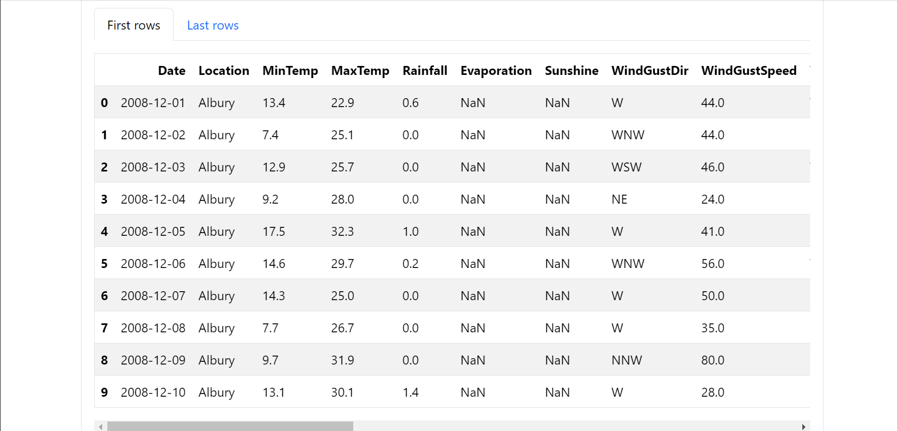
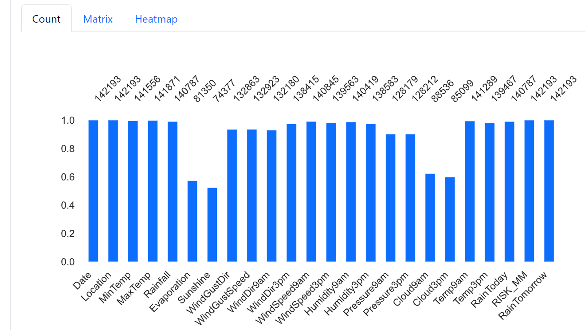
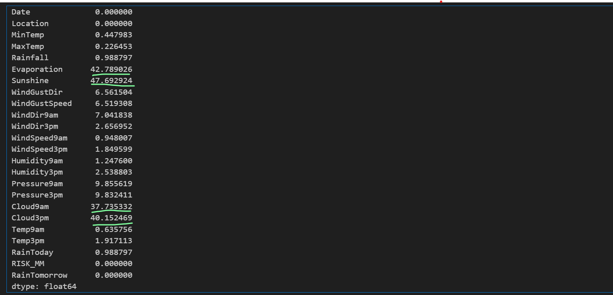
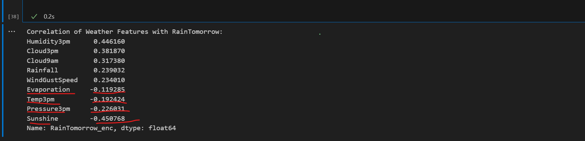
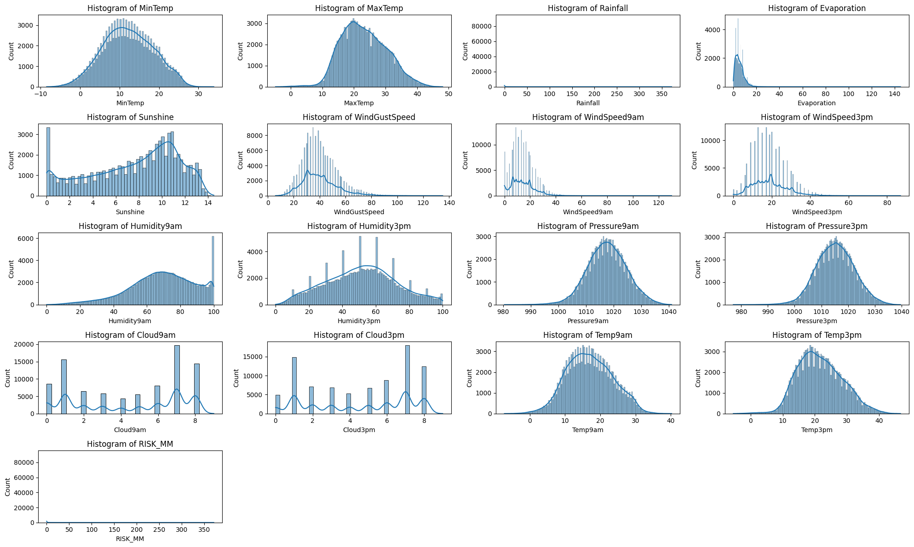

# 🌧️ Rainfall Prediction in Australia  
 

Given weather data, the task is to predict whether it will rain tomorrow. The target variable `RainTomorrow` is binary: **Yes** or **No**.

---

## 🚀 Tools and Libraries Used  

| **Library/Tool** | **Link** | **Icon** |
|------------------|----------|----------|
| **Scikit-learn** | [Scikit-learn](https://scikit-learn.org) |  |
| **Seaborn** | [Seaborn](https://seaborn.pydata.org) |  |
| **Logistic Regression** | [Logistic Regression](https://scikit-learn.org/stable/modules/linear_model.html#logistic-regression) | ⚙️ |
| **XGBoost** | [XGBoost](https://xgboost.readthedocs.io) |  |
| **CatBoost** | [CatBoost](https://catboost.ai) |  |
| **Plotly Express** | [Plotly Express](https://plotly.com/python/plotly-express/) |  |

---

## 📝 Project Description  

The goal of this project is to develop a machine learning model that predicts whether it will rain tomorrow based on historical weather data. This involves analyzing various meteorological factors such as temperature, humidity, wind speed, and pressure to determine their influence on rainfall.

---

# About the dataset 

The dataset was obtained from kaggle , it contains data about weather data in Australia collected from 2008 to 2017 , [here link](https://www.kaggle.com/datasets/trisha2094/weatheraus)
The dataset contains very many weather related variables that may seem exiciting but the screenshot is only showing a few of the variables 

---
# Missingness in the dataset  

The dataset had variables with missing values wwhere some variables had really high percentage of missingness where those wth high percentage of missigness were dropped

---

# Percentage of Misssingness  in the data 

I calculated the percentage of each variable contributing to missingness in the dataset , we found out that some variables like Evaporation and Sunshine really have high percentage of missingness ,

 The screenshot below shows a calculated percentage of missingness per variable , but what was of high  corncern where the underlined  variables with high Missingness , these variables need to be Handled carefully before modelling since they can introduce bias in the data 

 

 The high variables were dropped after checking there correlation with the Target RainfallTommorrow , since all of them had a negative corrrelaation with the target i decided to opt for deleting them , the screenshot sshows the correlation of the high variables with missigness with the target
 

 The rest of the variables were imputed mean , i impuetd with mean since the remaing percentage of missigness was not to  heavy , other imputation techiniques like KNN and iterative impueter came across my mind also

 ----
 # Distribution of the variables 
 
 Since we were aiming to for a classification modelling , we had to understand the distribution of the dataset in hand to know if it will really handle parametric classification Models for example Logistic Regression , the screenshot tells us that most of our data is not heavily skewed , so there will be no need to Transform the variable so that we achieve normality
 

 
 
 

